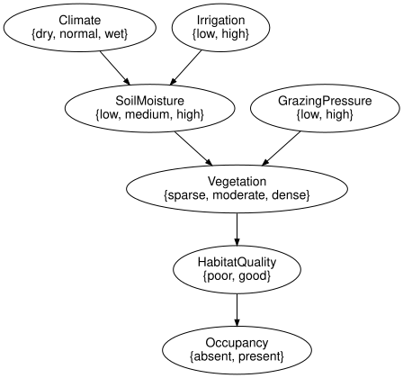
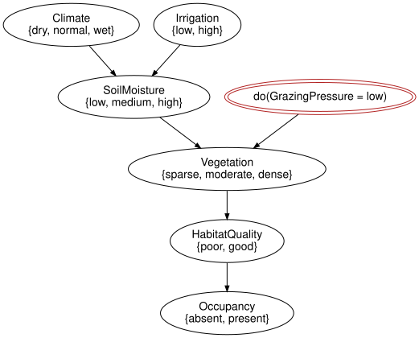

# The reference habitat network
Simon Frost

- [Overview](#overview)
- [Setup](#setup)
- [Validation](#validation)
- [Joint distribution versus exact
  inference](#joint-distribution-versus-exact-inference)
- [Evidence](#evidence)
- [Observing versus intervening](#observing-versus-intervening)
- [The same model from Netica and GeNIe
  files](#the-same-model-from-netica-and-genie-files)
- [Summary](#summary)
- [References](#references)

## Overview

SPEC section 45 fixes a small ecological Bayesian network as the
integration test of the whole ecosystem:

``` text
Climate -> SoilMoisture -> Vegetation -> HabitatQuality -> Occupancy
Irrigation -> SoilMoisture
GrazingPressure -> Vegetation
```

This vignette runs it end to end: the model from the zoo, its picture,
validation, the brute-force joint distribution against exact inference,
evidence, the difference between observing and intervening on grazing
pressure, and the same answers from the Netica and GeNIe files that ship
with `BayesianNetworkFormats.jl`.

The network is deliberately in the shape the ecological guidelines ask
for ([Marcot et al. 2006](#ref-Marcot2006); [Chen and Pollino
2012](#ref-ChenPollino2012)): a small number of discretised variables,
each arc a stated mechanism, and a management lever separated from the
quantity it acts on – which is also where the discretisation and
elicitation costs discussed by Uusitalo ([2007](#ref-Uusitalo2007)) and
Kuhnert et al. ([2010](#ref-Kuhnert2010)) would fall in a real study.

## Setup

``` julia
using EcologicalBayesianNetworks
using BayesianNetworks
using BayesianNetworkInference
m = load_model("reference_habitat_bn")
```

    BayesModel(7 variables, 7 mechanisms, 7 kernels)

`load_model` returns `BayesianNetworks.reference_habitat_model()`, the
structure of `reference_habitat_bn()` with the conditional probability
tables of the `habitat_reference` fixtures bound. Chance variables are
ellipses; every arc is a mechanism input.

``` julia
to_graphviz(m)
```



``` julia
model_summary("reference_habitat_bn")
```

    ModelSummary reference_habitat_bn (Reference habitat network (SPEC section 45))
      format / licence     julia / MIT (builtin)
      nodes                7 (7 chance, 0 decision, 0 utility)
      arcs                 6
      largest state space  3
      largest in-degree    2
      load_model           BayesModel

## Validation

`validate` checks the syntax (one mechanism per variable, acyclic,
contiguous positions) and, with `semantics = true`, that every mechanism
resolves to a kernel whose domain and codomain match its parents and
target and that every row sums to one. It returns `nothing` when
everything is in order.

``` julia
validate(m; closed = true, unique_names = true, semantics = true)
```

## Joint distribution versus exact inference

With seven variables the joint distribution has only 432 entries, so the
reference semantics of SPEC section 14, the product of all the kernels,
can be enumerated outright. `joint_distribution` returns it as a state
`I -> (x) variables`.

``` julia
J = joint_distribution(m)
size(J.table), sum(J.table)
```

    ((3, 2, 3, 2, 3, 2, 2), 1.0000000000000002)

`marginal` sums the joint; `BayesianNetworkInference.infer` answers the
same query by variable elimination without ever forming the joint. The
two agree to rounding.

``` julia
p_occ = marginal(m, :Occupancy)
```

    FiniteKernel{Float64}(I → Occupancy{absent,present})
                   ()
      absent   0.5238
      present  0.4762

``` julia
post, diag = infer(m, :Occupancy)
post.table ≈ p_occ.table, diag
```

    (true, InferenceDiagnostics([:Climate, :Irrigation, :SoilMoisture, :GrazingPressure, :Vegetation, :HabitatQuality], 18, 6, 2))

The junction-tree backend gives every marginal from one calibration:

``` julia
ms = all_marginals(m; backend = JunctionTree())
round.(ms[:Vegetation].table; digits = 4)
```

    3-element Vector{Float64}:
     0.3611
     0.3798
     0.259

Ancestral sampling (SPEC section 18) draws from the same distribution;
the empirical frequency of occupancy converges to the exact value.

``` julia
s = ancestral_sample(m, 20_000)
round.(empirical_marginal(s, :Occupancy).table; digits = 3)
```

    2-element Vector{Float64}:
     0.526
     0.474

## Evidence

Evidence conditions the joint. `posterior` reads the numbers off as a
dictionary; `observe` records the evidence on the model so that every
later query uses it.

``` julia
posterior(m, :Occupancy; evidence = Dict(:Vegetation => :dense))
```

    Dict{Symbol, Float64} with 2 entries:
      :present => 0.6675
      :absent  => 0.3325

``` julia
me = observe(m, :Vegetation => :dense)
marginal(me, :Occupancy).table ≈ infer(me, :Occupancy)[1].table
```

    true

## Observing versus intervening

SPEC section 45 asks for
`P(Occupancy = present | do(GrazingPressure = low))`. A hard
intervention rewrites the mechanism of `GrazingPressure` into the point
mass at `low` (SPEC sections 21 and 22); observation conditions on the
event instead. The two operations are recorded differently: the
intervention appears in the syntax and the history, the observation in
the evidence.

``` julia
low_do = do_intervention(m, :GrazingPressure => :low)
low_obs = observe(m, :GrazingPressure => :low)
(intervene = marginal(low_do, :Occupancy).table[2], observe = marginal(low_obs, :Occupancy).table[2])
```

    (intervene = 0.51166025, observe = 0.51166025)

``` julia
# The raw events carry a wall-clock timestamp, which would make this committed
# output differ on every render; show what the intervention did instead.
[(e.kind, e.target, e.added.kernel_ref) for e in history(low_do)]
```

    1-element Vector{Tuple{Symbol, Symbol, PointMassRef}}:
     (:hard, :GrazingPressure, PointMassRef(:low))

``` julia
to_graphviz(low_do)
```



Because `GrazingPressure` is a root, the two numbers coincide: nothing
upstream can be learned from it. On a variable with parents the
difference shows. Observing dense vegetation is evidence that the soil
was moist; forcing dense vegetation tells us nothing about the soil,
because the arc from `SoilMoisture` has been cut.

``` julia
(intervene = round.(marginal(do_intervention(m, :Vegetation => :dense), :SoilMoisture).table; digits = 4),
 observe = round.(marginal(observe(m, :Vegetation => :dense), :SoilMoisture).table; digits = 4),
 prior = round.(marginal(m, :SoilMoisture).table; digits = 4))
```

    (intervene = [0.288, 0.403, 0.309], observe = [0.0834, 0.35, 0.5666], prior = [0.288, 0.403, 0.309])

Downstream of the rewritten variable the two agree, since `Occupancy`
depends on the rest of the network only through `Vegetation`:

``` julia
marginal(do_intervention(m, :Vegetation => :dense), :Occupancy).table ≈
    marginal(observe(m, :Vegetation => :dense), :Occupancy).table
```

    true

## The same model from Netica and GeNIe files

The `habitat_reference` fixtures of `BayesianNetworkFormats.jl` hold the
same network in Netica `.dne` and GeNIe `.xdsl` form. `read_bayesnet`
parses either into a `BayesModel`, and the intervention query gives
identical answers from all three sources.

``` julia
dne = read_bayesnet(fixture_path("dne/habitat_reference.dne"))
xdsl = read_bayesnet(fixture_path("xdsl/habitat_reference.xdsl"))
dne ≈ m, xdsl ≈ m
```

    (true, true)

``` julia
query(model) = marginal(do_intervention(model, :GrazingPressure => :low), :Occupancy).table[2]
query(m), query(dne), query(xdsl)
```

    (0.51166025, 0.51166025, 0.51166025)

The zoo’s `model_ir` gives the `NetworkIR` of the Julia-built model,
which `write_network` can turn back into any of the file formats.

``` julia
ir = model_ir("reference_habitat_bn")
[(v.id, v.parents) for v in ir.variables]
```

    7-element Vector{Tuple{Symbol, Vector{Symbol}}}:
     (:Climate, [])
     (:Irrigation, [])
     (:SoilMoisture, [:Climate, :Irrigation])
     (:GrazingPressure, [])
     (:Vegetation, [:SoilMoisture, :GrazingPressure])
     (:HabitatQuality, [:Vegetation])
     (:Occupancy, [:HabitatQuality])

## Summary

The SPEC section 45 reference network is small enough that exact
inference can be checked against the brute-force joint distribution
entry by entry, which is what makes it the integration test of the whole
ecosystem. Observing vegetation can update the upstream soil moisture,
whereas intervening on vegetation leaves soil moisture at its prior.
GrazingPressure is a root in this example, so observing it updates
nothing upstream. Downstream agreement requires the relevant
screening-off conditions; it is not a general consequence of being
downstream. The API keeps observation and intervention distinct. The
same model read from the Netica and GeNIe files gives the same numbers.
The next vignette, *The management influence diagram*, adds a decision
and two utilities to this network.

## References

<div id="refs" class="references csl-bib-body hanging-indent">

<div id="ref-ChenPollino2012" class="csl-entry">

Chen, Serena H., and Carmel A. Pollino. 2012. “Good Practice in Bayesian
Network Modelling.” *Environmental Modelling & Software* 37: 134–45.
<https://doi.org/10.1016/j.envsoft.2012.03.016>.

</div>

<div id="ref-Kuhnert2010" class="csl-entry">

Kuhnert, Petra M., Tara G. Martin, and Shane P. Griffiths. 2010. “A
Guide to Eliciting and Using Expert Knowledge in Bayesian Ecological
Models.” *Ecology Letters* 13 (7): 900–914.
<https://doi.org/10.1111/j.1461-0248.2010.01477.x>.

</div>

<div id="ref-Marcot2006" class="csl-entry">

Marcot, Bruce G., J. Douglas Steventon, Glenn D. Sutherland, and Robert
K. McCann. 2006. “Guidelines for Developing and Updating Bayesian Belief
Networks Applied to Ecological Modeling and Conservation.” *Canadian
Journal of Forest Research* 36 (12): 3063–74.
<https://doi.org/10.1139/x06-135>.

</div>

<div id="ref-Uusitalo2007" class="csl-entry">

Uusitalo, Laura. 2007. “Advantages and Challenges of Bayesian Networks
in Environmental Modelling.” *Ecological Modelling* 203 (3–4): 312–18.
<https://doi.org/10.1016/j.ecolmodel.2006.11.018>.

</div>

</div>
