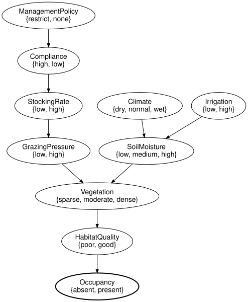
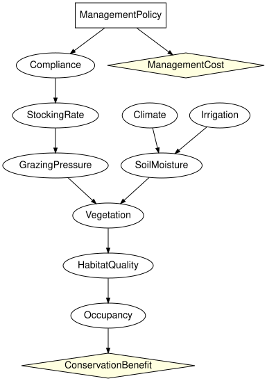

# Direct intervention versus imperfect implementation
Simon Frost

- [Overview](#overview)
- [Setup](#setup)
- [The implementation chain as an open
  network](#the-implementation-chain-as-an-open-network)
- [Binding the numbers](#binding-the-numbers)
- [Direct intervention versus deciding the
  policy](#direct-intervention-versus-deciding-the-policy)
- [Compliance as the lever](#compliance-as-the-lever)
- [The cost-benefit trade-off as an influence
  diagram](#the-cost-benefit-trade-off-as-an-influence-diagram)
- [Summary](#summary)
- [References](#references)

## Overview

A manager cannot set grazing pressure. What can be set is a policy;
whether it lowers the pressure depends on compliance and on the stocking
rate that results. SPEC section 42 asks for this chain to be modelled
explicitly,

``` text
ManagementPolicy -> Compliance -> StockingRate -> GrazingPressure -> Vegetation
```

rather than only as `do(GrazingPressure = low)`. This vignette builds
the chain as an open network, glues it onto the reference habitat
network of SPEC section 45 with the composition operations of
`CategoricalBayesianNetworks.jl`, compares the direct intervention with
the implementable one under uncertain compliance, and finishes with the
cost-benefit trade-off as a small influence diagram.

Modelling the lever rather than the outcome is what makes the result
usable for management: a conservation decision is taken over the policy
that can be set, not over the ecological variable one wishes to control
([Marcot et al. 2006](#ref-Marcot2006); [Runge et al.
2011](#ref-Runge2011)).

## Setup

``` julia
using EcologicalBayesianNetworks
using BayesianNetworks
using CategoricalBayesianNetworks: Open, compose, glue, apex, inputs, outputs
using InfluenceDiagrams
ref = reference_habitat_model()
```

    BayesModel(7 variables, 7 mechanisms, 7 kernels)

## The implementation chain as an open network

The chain is a closed network on its own (the policy has a prior), and
its `GrazingPressure` is an output. The habitat network is written with
`GrazingPressure` left exogenous (`closed = false`), so that it can be
an input. `Open` checks the typed-interface rule: inputs have no
mechanism, every mechanism-free variable is an input.

``` julia
chain = bayesnet(:ManagementPolicy => [:restrict, :none], :Compliance => [:high, :low],
                 :StockingRate => [:low, :high], :GrazingPressure => [:low, :high];
                 mechanisms = [:Compliance => :ManagementPolicy, :StockingRate => :Compliance,
                               :GrazingPressure => :StockingRate])
habitat = bayesnet(:Climate => [:dry, :normal, :wet], :Irrigation => [:low, :high],
                   :SoilMoisture => [:low, :medium, :high], :GrazingPressure => [:low, :high],
                   :Vegetation => [:sparse, :moderate, :dense], :HabitatQuality => [:poor, :good],
                   :Occupancy => [:absent, :present];
                   mechanisms = [:Climate => (), :Irrigation => (),
                                 :SoilMoisture => (:Climate, :Irrigation),
                                 :Vegetation => (:SoilMoisture, :GrazingPressure),
                                 :HabitatQuality => :Vegetation, :Occupancy => :HabitatQuality],
                   closed = false)
C = Open(chain; outputs = [:GrazingPressure])
H = Open(habitat; inputs = [:GrazingPressure], outputs = [:Occupancy])
println(C)
println(H)
```

    OpenBayesNet(4 variables, 4 mechanisms; Symbol[] -> [:GrazingPressure])
    OpenBayesNet(7 variables, 6 mechanisms; [:GrazingPressure] -> [:Occupancy])

`compose` glues the output of the chain to the input of the habitat
network (a pushout along the shared variable space);
`glue(C, H; along = [:GrazingPressure => :GrazingPressure])` does the
same with explicit pairs. The composite has no inputs left and
`Occupancy` as its output.

``` julia
G = compose(C, H)
inputs(G), outputs(G), sort(variable_names(apex(G)))
```

    (Symbol[], [:Occupancy], [:Climate, :Compliance, :GrazingPressure, :HabitatQuality, :Irrigation, :ManagementPolicy, :Occupancy, :SoilMoisture, :StockingRate, :Vegetation])

``` julia
to_graphviz(G)
```



## Binding the numbers

The apex of the composite is an ordinary closed network. The habitat
kernels are copied from the reference model (`bind_kernel` accepts a
kernel whose axes match the mechanism’s parents); the chain gets tables
of its own: a restriction is complied with 70% of the time, compliance
keeps the stocking rate low 90% of the time, and a low stocking rate
gives low pressure 90% of the time.

``` julia
full = BayesModel(apex(G))
full = bind_kernel(full, [x => kernel(ref, x)
                          for x in (:Climate, :Irrigation, :SoilMoisture, :Vegetation,
                                    :HabitatQuality, :Occupancy)])
full = bind_cpt(full, [:ManagementPolicy => [0.5, 0.5],
                       :Compliance => [0.7 0.3; 0.1 0.9],        # rows: restrict, none
                       :StockingRate => [0.9 0.1; 0.2 0.8],      # rows: high, low compliance
                       :GrazingPressure => [0.9 0.1; 0.15 0.85]]) # rows: low, high stocking
validate(full; closed = true, unique_names = true, semantics = true)
```

## Direct intervention versus deciding the policy

`do(GrazingPressure = low)` is the ideal: the pressure is low with
certainty. `do(ManagementPolicy = restrict)` is what a manager can do;
the pressure is then low only with the probability the chain allows.

``` julia
present(m) = round(marginal(m, :Occupancy).table[2]; digits = 4)
(baseline = present(full),
 do_pressure_low = present(do_intervention(full, :GrazingPressure => :low)),
 do_policy_restrict = present(do_intervention(full, :ManagementPolicy => :restrict)),
 do_policy_none = present(do_intervention(full, :ManagementPolicy => :none)))
```

    (baseline = 0.4769, do_pressure_low = 0.5117, do_policy_restrict = 0.4881, do_policy_none = 0.4658)

``` julia
round.(marginal(do_intervention(full, :ManagementPolicy => :restrict), :GrazingPressure).table; digits = 4)
```

    2-element Vector{Float64}:
     0.6675
     0.3325

Restricting grazing moves the occupancy probability only part of the way
towards what guaranteed low pressure would give, because a third of the
time the restriction does not translate into low pressure. Since
`ManagementPolicy` is a root, observing the policy and intervening on it
agree; the difference between `observe` and `do_intervention` appears
further down the chain, where observing low pressure is also evidence
about compliance and the policy:

``` julia
(observe_low = round.(marginal(observe(full, :GrazingPressure => :low), :ManagementPolicy).table; digits = 4),
 do_low = round.(marginal(do_intervention(full, :GrazingPressure => :low), :ManagementPolicy).table; digits = 4))
```

    (observe_low = [0.6544, 0.3456], do_low = [0.5, 0.5])

## Compliance as the lever

Rebinding the `Compliance` table sweeps the probability that a
restriction is complied with; the effect of the policy on occupancy
grows with it and reaches the direct intervention only in the limit of
perfect implementation.

``` julia
println(" P(comply)   P(present | do(restrict))")
for p in (0.3, 0.5, 0.7, 0.9, 1.0)
    m = bind_cpt(full, :Compliance => [p 1-p; 0.1 0.9])
    println(lpad(p, 8), "      ", present(do_intervention(m, :ManagementPolicy => :restrict)))
end
```

     P(comply)   P(present | do(restrict))
         0.3      0.4732
         0.5      0.4807
         0.7      0.4881
         0.9      0.4955
         1.0      0.4993

## The cost-benefit trade-off as an influence diagram

Making `ManagementPolicy` a decision and attaching a conservation
benefit to occupancy and a cost to the restriction turns the question
into a decision problem. The kernels are the ones already bound above;
the diagram only adds the decision and the two utility nodes.

``` julia
id = influence_diagram(:ManagementPolicy => [:restrict, :none], :Compliance => [:high, :low],
                       :StockingRate => [:low, :high], :GrazingPressure => [:low, :high],
                       :Climate => [:dry, :normal, :wet], :Irrigation => [:low, :high],
                       :SoilMoisture => [:low, :medium, :high],
                       :Vegetation => [:sparse, :moderate, :dense],
                       :HabitatQuality => [:poor, :good], :Occupancy => [:absent, :present];
                       mechanisms = [:Compliance => :ManagementPolicy, :StockingRate => :Compliance,
                                     :GrazingPressure => :StockingRate,
                                     :SoilMoisture => (:Climate, :Irrigation),
                                     :Vegetation => (:SoilMoisture, :GrazingPressure),
                                     :HabitatQuality => :Vegetation, :Occupancy => :HabitatQuality],
                       decisions = [:ManagementPolicy => Symbol[]],
                       utilities = [:ConservationBenefit => :Occupancy,
                                    :ManagementCost => :ManagementPolicy])
idm = InfluenceDiagramModel(id)
idm = bind_kernel(idm, [x => kernel(full, x)
                        for x in (:Climate, :Irrigation, :SoilMoisture, :Vegetation, :HabitatQuality,
                                  :Occupancy, :Compliance, :StockingRate, :GrazingPressure)])
idm = bind_utility(idm, [:ConservationBenefit => [0.0, 1000.0], :ManagementCost => [-10.0, 0.0]])
to_graphviz(idm; states = false)
```



The expected utility of each action, and the optimum (both backends
agree):

``` julia
[a => round(expected_utility(idm, :ManagementPolicy => a); digits = 2) for a in (:restrict, :none)]
```

    2-element Vector{Pair{Symbol, Float64}}:
     :restrict => 478.11
         :none => 465.79

``` julia
sol = optimize(idm)
sol.expected_utility, policy_table(sol.strategy[:ManagementPolicy]),
optimize(idm, ExhaustivePolicySearch()).expected_utility ≈ sol.expected_utility
```

    (478.10640718749994, fill(:restrict), true)

At 70% compliance the restriction is worth its cost of 10. Whether it
stays worth it depends on compliance, which is exactly the point of
modelling the chain: at low compliance the same restriction no longer
pays.

``` julia
println(" P(comply)   EU(restrict)   EU(none)   optimal")
for p in (0.3, 0.5, 0.7, 0.9, 1.0)
    m = bind_cpt(idm, :Compliance => [p 1-p; 0.1 0.9])
    eu = [expected_utility(m, :ManagementPolicy => a) for a in (:restrict, :none)]
    println(lpad(p, 8), "      ", lpad(round(eu[1]; digits = 2), 8), "     ",
            lpad(round(eu[2]; digits = 2), 8), "   ", eu[1] > eu[2] ? :restrict : :none)
end
```

     P(comply)   EU(restrict)   EU(none)   optimal
         0.3        463.23       465.79   none
         0.5        470.67       465.79   restrict
         0.7        478.11       465.79   restrict
         0.9        485.54       465.79   restrict
         1.0        489.26       465.79   restrict

Finally, the value of perfect implementation: under
`do(GrazingPressure = low)` the decision no longer matters for the
ecology, the optimal action is the free one, and the gain over the best
implementable decision is what a manager could pay for a mechanism that
guaranteed low pressure.

``` julia
direct = optimize(do_intervention(idm, :GrazingPressure => :low))
(perfect = round(direct.expected_utility; digits = 2),
 best_decision = round(sol.expected_utility; digits = 2),
 value_of_perfect_implementation = round(direct.expected_utility - sol.expected_utility; digits = 2))
```

    (perfect = 511.66, best_decision = 478.11, value_of_perfect_implementation = 33.55)

## Summary

Writing the implementation chain out as an open network and gluing it
onto the habitat network makes the difference between
`do(GrazingPressure = low)` and choosing a management policy explicit
and quantitative: the implementable decision is worth strictly less, and
the gap is the value of perfect implementation – what a mechanism that
guaranteed compliance would be worth. Compliance, not the policy label,
is the lever the numbers respond to. The next vignette, *A Song Sparrow
decision network*, leaves the reference fixtures for a published network
from the BNMA repository.

## References

```@raw html
<div id="refs" class="references csl-bib-body hanging-indent">
```

```@raw html
<div id="ref-Marcot2006" class="csl-entry">
```

Marcot, Bruce G., J. Douglas Steventon, Glenn D. Sutherland, and Robert
K. McCann. 2006. “Guidelines for Developing and Updating Bayesian Belief
Networks Applied to Ecological Modeling and Conservation.” *Canadian
Journal of Forest Research* 36 (12): 3063–74.
<https://doi.org/10.1139/x06-135>.

```@raw html
</div>
```

```@raw html
<div id="ref-Runge2011" class="csl-entry">
```

Runge, Michael C., Sarah J. Converse, and James E. Lyons. 2011. “Which
Uncertainty? Using Expert Elicitation and Expected Value of Information
to Design an Adaptive Program.” *Biological Conservation* 144 (4):
1214–23. <https://doi.org/10.1016/j.biocon.2010.12.020>.

```@raw html
</div>
```

```@raw html
</div>
```
