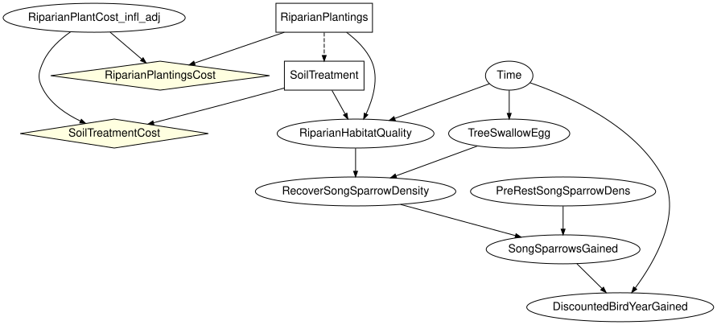
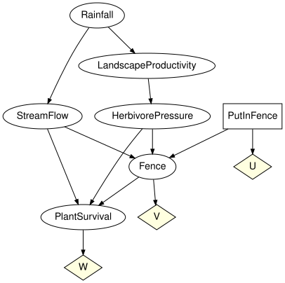
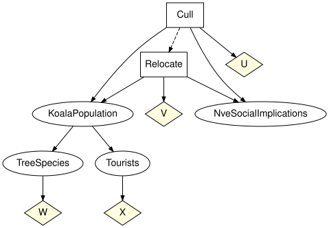

# A real decision network from the zoo
Simon Frost

- [Overview](#overview)
- [Setup](#setup)
- [Structure](#structure)
- [Finding nodes without tables](#finding-nodes-without-tables)
- [Repairing the network and solving
  it](#repairing-the-network-and-solving-it)
- [Waterhole Fence: a solved decision
  network](#waterhole-fence-a-solved-decision-network)
- [Koalas: two decisions in sequence](#koalas-two-decisions-in-sequence)
- [Summary](#summary)
- [References](#references)

## Overview

The BNMA repository ([BNMA 2026](#ref-BNMA)) publishes Bayesian decision
networks built for real restoration programmes. This vignette takes the
Song Sparrow riparian-restoration network of
<span class="nocase">Kotalik et al.</span> ([2026](#ref-Kotalik2026))
apart with the zoo’s loaders, explains why it loads but cannot be solved
as shipped (two Netica finding nodes carry no tables), repairs it with
two explicitly stated assumptions and solves it - which turns out to say
as much about the network’s objective as about restoration - and then
solves two fully tabled decision networks from the same repository,
Waterhole Fence and Koalas, with both decision backends.

## Setup

``` julia
using EcologicalBayesianNetworks
using InfluenceDiagrams
spec = model_info("song_sparrow_bdn")
println(spec.citation)
spec.doi, spec.licence, spec.redistribution
```

    Kotalik, C. J., Rowland, F. E., Marcot, B. G., Skrabis, K., Walters, D. M., Hinck, J. E., Clements, W., Richer, E. and Isanhart, J. (2026). Causal networks to inform decisions for ecological restoration. Environmental Management 76(7).

    ("10.59381/ofwegrfqyo", "CC-BY (version unstated)", "verbatim")

The file is the original `.dne` served by BNMA, committed verbatim under
CC BY 4.0 (BN DOI 10.59381/ofwegrfqyo) next to its `LICENSE.txt`.

## Structure

`model_summary` parses the file without building a model. Seven
`CONSTANT` nodes (titles and notes in the Netica canvas) are skipped;
two chance nodes have no conditional probability table.

``` julia
model_summary("song_sparrow_bdn")
```

    ModelSummary song_sparrow_bdn (Song Sparrow riparian restoration decision network (SongSparrowBDN_v250804))
      format / licence     dne / CC-BY (version unstated) (verbatim)
      nodes                12 (8 chance, 2 decision, 2 utility)
      arcs                 15
      largest state space  6
      largest in-degree    3
      skipped nodes        7
      nodes without a CPT  2
      load_model           InfluenceDiagramModel (2 mechanisms unbound)

`load_model` returns an `InfluenceDiagramModel`: chance nodes become
variables with mechanisms, decision nodes become decisions whose
information set is the node’s parent list, and utility nodes become
utility nodes with tabular utilities.

``` julia
ss = load_model("song_sparrow_bdn")
```

    InfluenceDiagramModel(10 variables, 2 decisions, 2 utilities, 6 kernels, 2 bound)

``` julia
to_graphviz(ss; states = false)
```



The node titles from the file are kept in `extras`:

``` julia
id = syntax(ss)
titles = extras(ss)[:titles]
[(x, titles[x]) for x in chance_names(id)]
```

    8-element Vector{Tuple{Symbol, String}}:
     (:RiparianPlantCost_infl_adj, "Inflation Adjustment (%)")
     (:Time, "Time")
     (:RiparianHabitatQuality, "Riparian Habitat Quality ")
     (:TreeSwallowEgg, "Bird Egg-Equivalent Hg (ug/g)")
     (:RecoverSongSparrowDensity, "Recovering Song Sparrow Density (n/acre)")
     (:PreRestSongSparrowDens, "Pre-Restoration Song Sparrow Density (n/acre)")
     (:SongSparrowsGained, "Song Sparrow Density Gained (per acre)")
     (:DiscountedBirdYearGained, "Discounted Bird Years Gained")

Two decisions in sequence: the soil treatment is chosen knowing which
planting treatment was picked (an information arc, so the diagram is
regular), and both decisions have a cost utility that also depends on
the inflation adjustment.

``` julia
[(decision_name(id, d), states(id, variable_name(id, decision_variable(id, d))), information_names(id, d))
 for d in decisions(id)]
```

    2-element Vector{Tuple{Symbol, Vector{Symbol}, Vector{Symbol}}}:
     (:RiparianPlantings, [:None, :Willow_Plant, :Herbaceous_Seed, :Willow_AND_Herbaceous], [])
     (:SoilTreatment, [:None, :Topsoil_Amendment], [:RiparianPlantings])

``` julia
[(utility_name(id, u), utility_scope_names(id, u)) for u in utilities(id)]
```

    2-element Vector{Tuple{Symbol, Vector{Symbol}}}:
     (:RiparianPlantingsCost, [:RiparianPlantings, :RiparianPlantCost_infl_adj])
     (:SoilTreatmentCost, [:SoilTreatment, :RiparianPlantCost_infl_adj])

## Finding nodes without tables

`RiparianPlantCost_infl_adj` (the inflation adjustment, in percent) and
`Time` are Netica finding or equation nodes: continuous quantities that
the modeller enters as findings when the network is used, so the file
stores their discretisation and a default finding but no `probs` block.
`BayesianNetworkFormats.validate` rejects such a network unless
`allow_missing_tables = true`, which the manifest sets, and the two
mechanisms stay unbound in the model:

``` julia
missing_kernels(ss)
```

    2-element Vector{Symbol}:
     :RiparianPlantCost_infl_adj
     :Time

Everything structural works on the model (drawing, information sets,
decision order), but semantic validation and optimisation need every
kernel, so they stop with a `MissingKernelError` that names the
variable:

``` julia
try
    optimize(ss)
catch e
    println(sprint(showerror, e))
end
```

    MissingKernelError: the mechanism of variable :RiparianPlantCost_infl_adj has reference BayesianNetworks.NoRef(), which does not resolve to a kernel

## Repairing the network and solving it

The diagnosis above is where the model as published stops. Solving it
means supplying the two findings, which is a modelling decision, so it
is worth being exact about what is being assumed and by whom.

Both unbound nodes are roots, and the file records the finding the
authors left set in Netica: the inflation adjustment at its lowest band
and the projection at year 5.

``` julia
ir = model_ir("song_sparrow_bdn")
unbound = missing_kernels(ss)
defaults = Dict(v.id => v.extras[:evidence] for v in ir.variables if v.id in unbound)
```

    Dict{Symbol, String} with 2 entries:
      :RiparianPlantCost_infl_adj => "0 to 2.5"
      :Time                       => "Year 5"

Binding a point mass on each of those states says: *this network is
being solved for one inflation band and one time horizon, the ones the
file was saved with.* That is a reader’s assumption, not the authors’:
the file states a finding, not a prior, and a different analyst could
just as defensibly put a uniform over the four inflation bands or solve
the whole thing again at year 20. Nothing below is a claim about what
<span class="nocase">Kotalik et al.</span> ([2026](#ref-Kotalik2026))
believe.

``` julia
point_mass(x, state) = [s == Symbol(state) ? 1.0 : 0.0 for s in states(id, x)]
repaired = bind_cpt(ss, [x => point_mass(x, defaults[x]) for x in unbound])
missing_kernels(repaired), validate(repaired; closed = true, unique_names = true, semantics = true)
```

    (Symbol[], nothing)

With every mechanism bound the network validates and both backends solve
it:

``` julia
sol_ss = optimize(repaired)
sol_ss.expected_utility,
[(decision_name(id, d), unique(policy_table(sol_ss.strategy[decision_name(id, d)]))) for d in decisions(id)],
optimize(repaired, ExhaustivePolicySearch()).expected_utility ≈ sol_ss.expected_utility
```

    (22550.0, [(:RiparianPlantings, [:Willow_AND_Herbaceous]), (:SoilTreatment, [:Topsoil_Amendment])], true)

Read that answer carefully before repeating it. The optimum is to plant
willow and herbaceous species and to amend the topsoil, with an expected
utility of 22550 - and 22550 is the *most expensive* plan in the file.
The two utility nodes hold construction costs entered as positive
numbers, and the ecological outcome the restoration is for,
`DiscountedBirdYearGained`, carries no utility node at all:

``` julia
[(utility_name(id, u), utility_scope_names(id, u)) for u in utilities(id)]
```

    2-element Vector{Tuple{Symbol, Vector{Symbol}}}:
     (:RiparianPlantingsCost, [:RiparianPlantings, :RiparianPlantCost_infl_adj])
     (:SoilTreatmentCost, [:SoilTreatment, :RiparianPlantCost_infl_adj])

``` julia
Dict(v.id => v.table for v in ir.variables if v.id == :SoilTreatmentCost)
```

    Dict{Symbol, Matrix{Float64}} with 1 entry:
      :SoilTreatmentCost => [0.0 0.0 0.0 0.0; 8200.0 8400.0 8600.0 8800.0]

So maximising expected utility on this file maximises spending. Netica’s
convention is that a utility node holds whatever number the modeller
typed and the sign is theirs to choose; this network is built to be read
node by node, with costs and bird-years compared by the analyst, rather
than optimised. Giving the cost tables the sign an expected-utility
maximiser needs flips the answer to the other corner:

``` julia
costs = Dict(v.id => v.table for v in ir.variables
             if v.id in (utility_name(id, u) for u in utilities(id)))
signed = bind_utility(repaired, [u => -t for (u, t) in costs])
sol_signed = optimize(signed)
sol_signed.expected_utility,
[(decision_name(id, d), unique(policy_table(sol_signed.strategy[decision_name(id, d)]))) for d in decisions(id)]
```

    (0.0, [(:RiparianPlantings, [:None]), (:SoilTreatment, [:None])])

Do nothing, at a cost of zero. Both corners are correct arithmetic on an
incomplete objective: with costs on one side and no value on the other,
the maximiser can only ever pick an extreme. Turning this into a
decision model that recommends anything needs a utility on
`DiscountedBirdYearGained` - a value per discounted bird-year - and that
number belongs to the programme, not to this vignette. What the zoo can
honestly deliver is the network exactly as published, a typed failure
that names the two nodes standing between it and a solution, and a
repair whose every assumption is written down.

## Waterhole Fence: a solved decision network

Waterhole Fence (Bayesian Intelligence, 2015) is a teaching example of
an expected-value decision: whether to fence a waterhole to protect
plants from herbivores, given rainfall, stream flow and landscape
productivity. Every chance node has a table (the `Rainfall` prior sums
to one only within 5e-8, so the manifest asks the loader to
renormalise), so the model validates and solves.

``` julia
w = load_model("waterhole_fence")
validate(w; closed = true, unique_names = true, semantics = true)
to_graphviz(w; states = false)
```



The single decision has no information: the fence is built or not before
anything is observed. The expected utility of each fixed action:

``` julia
wid = syntax(w)
[a => round(expected_utility(w, :PutInFence => a); digits = 4) for a in states(wid, :PutInFence)]
```

    2-element Vector{Pair{Symbol, Float64}}:
     :Yes => -30.0833
      :No => -48.9819

Both backends agree on the optimum, and the optimal policy is the
constant `Yes`:

``` julia
sol = optimize(w)
sol.expected_utility, policy_table(sol.strategy[:PutInFence]),
optimize(w, ExhaustivePolicySearch()).expected_utility ≈ sol.expected_utility
```

    (-30.083300230595228, fill(:Yes), true)

The fence trades its own cost (`U`) and the fence outcome (`V`) against
plant survival (`W`); under the optimal strategy the plant-survival
distribution is

``` julia
marginal(instantiate(w, sol.strategy), :PlantSurvival)
```

    FiniteKernel{Float64}(I → PlantSurvival{Intact,Threatened,LocExtinct})
                      ()
      Intact       0.817
      Threatened  0.1265
      LocExtinct  0.0564

## Koalas: two decisions in sequence

Koalas (Thiruvady, 2015) has two decisions, whether to cull and whether
to relocate koalas on Fraser Island, with the relocation decision
informed by the culling decision, and four utilities (the costs of the
two actions, tree condition, tourism).

``` julia
k = load_model("koalas")
kid = syntax(k)
[(decision_name(kid, d), information_names(kid, d)) for d in decisions(kid)]
```

    2-element Vector{Tuple{Symbol, Vector{Symbol}}}:
     (:Cull, [])
     (:Relocate, [:Cull])

``` julia
to_graphviz(k; states = false)
```



With two decisions a fixed action must fix both; fixing only one leaves
the strategy incomplete:

``` julia
try
    expected_utility(k, :Cull => :No)
catch e
    println(sprint(showerror, e))
end
```

    IncompleteStrategyError: the strategy has no policy for decision(s) Relocate

``` julia
println(lpad("Cull \\ Relocate", 16), "   ", join(lpad.(string.(states(kid, :Relocate)), 8), " "))
for a in states(kid, :Cull)
    eu = [expected_utility(k, [:Cull => a, :Relocate => b]) for b in states(kid, :Relocate)]
    println(lpad(a, 16), "   ", join(lpad.(string.(round.(eu; digits = 2)), 8), " "))
end
```

     Cull \ Relocate        Yes       No    Maybe
                 Yes     -38.92    -69.8    -40.5
                  No       20.2    -28.6    -28.0
               Maybe      -10.2    -19.8    -15.0

The optimal strategy does not cull and relocates whatever the culling
decision was; the policy table of `Relocate` is indexed by the three
states of `Cull`. Decision variable elimination and the exhaustive
search over all $3 \times 3^3$ deterministic strategies agree.

``` julia
ksol = optimize(k)
ksol.expected_utility, policy_table(ksol.strategy[:Cull]), policy_table(ksol.strategy[:Relocate]),
optimize(k, ExhaustivePolicySearch()).expected_utility ≈ ksol.expected_utility
```

    (20.199999999999996, fill(:No), [:Yes, :Yes, :Yes], true)

``` julia
marginal(instantiate(k, ksol.strategy), :KoalaPopulation)
```

    FiniteKernel{Float64}(I → KoalaPopulation{Low,Medium,High})
                ()
      Low      0.5
      Medium  0.45
      High    0.05

## Summary

A network published as a decision model is not necessarily a solvable
one: the Song Sparrow diagram of <span class="nocase">Kotalik et
al.</span> ([2026](#ref-Kotalik2026)) loads cleanly but two Netica
finding nodes carry no tables, so it can only be solved after two
assumptions have been written down explicitly – and once it is, what the
numbers say is as much about how the objective was specified as about
restoration. Reporting that plainly is what the evaluation guidance asks
for ([Marcot 2012](#ref-Marcot2012); [Chen and Pollino
2012](#ref-ChenPollino2012)). Waterhole Fence and Koalas, from the same
repository, are fully tabled and are solved by both backends in
agreement. The next vignette, *Scenario analysis on the benchmark WATER
network*, moves to a network too large for the brute-force joint.

## References

The three models used here are published under CC BY 4.0 in the BNMA
repository ([BNMA 2026](#ref-BNMA)): Song Sparrow BDN (record 2893,
<span class="nocase">Kotalik et al.</span> ([2026](#ref-Kotalik2026)),
DOI 10.59381/ofwegrfqyo), Waterhole Fence (record 114, Bayesian
Intelligence Pty Ltd, 2015) and Koalas (record 126, D. Thiruvady, 2015).
Their manifests in `models/` carry the full citation, DOI and licence
for each.

<div id="refs" class="references csl-bib-body hanging-indent">

<div id="ref-BNMA" class="csl-entry">

BNMA. 2026. *The Bayesian Network Model Archive*.
<https://bnma.co/bnrepo/>.

</div>

<div id="ref-ChenPollino2012" class="csl-entry">

Chen, Serena H., and Carmel A. Pollino. 2012. “Good Practice in Bayesian
Network Modelling.” *Environmental Modelling & Software* 37: 134–45.
<https://doi.org/10.1016/j.envsoft.2012.03.016>.

</div>

<div id="ref-Kotalik2026" class="csl-entry">

<span class="nocase">Kotalik, Christopher J., Freya E. Rowland, Bruce G.
Marcot, et al.</span> 2026. “Causal Networks to Inform Decisions for
Ecological Restoration.” *Environmental Management* 76 (7).
<https://doi.org/10.59381/ofwegrfqyo>.

</div>

<div id="ref-Marcot2012" class="csl-entry">

Marcot, Bruce G. 2012. “Metrics for Evaluating Performance and
Uncertainty of Bayesian Network Models.” *Ecological Modelling* 230:
50–62. <https://doi.org/10.1016/j.ecolmodel.2012.01.013>.

</div>

</div>
