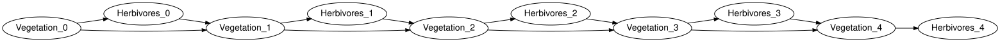
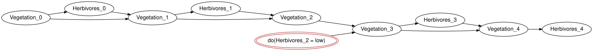

# Dynamic models and the roadmap
Simon Frost

- [Overview](#overview)
- [Setup](#setup)
- [Unrolling](#unrolling)
- [Intervening in one slice](#intervening-in-one-slice)
- [Management as an exogenous input](#management-as-an-exogenous-input)
- [Roadmap](#roadmap)
- [Summary](#summary)
- [References](#references)

## Overview

Ecological feedback is a cycle: vegetation feeds herbivores and
herbivores eat vegetation. A Bayesian network cannot hold a cycle, but a
dynamic Bayesian network can, by placing the two halves of the loop in
different time slices (SPEC section 43): `Vegetation_t -> Herbivores_t`
within a slice and `Herbivores_{t-1} -> Vegetation_t` across slices.
`BayesianNetworks.jl` represents such a model as a template that
`unroll` compiles, for any finite horizon, into an ordinary closed
network, so that everything in the earlier vignettes applies unchanged.
This vignette runs the vegetation-herbivore example, intervenes in one
slice, and closes with the roadmap for dynamic influence diagrams and
spatial models (SPEC section 44 and 47).

Feedback over time is the limitation most often raised against Bayesian
belief networks in ecology ([Uusitalo 2007](#ref-Uusitalo2007); [Landuyt
et al. 2013](#ref-Landuyt2013)), and the reason given when a network is
judged to have underperformed against data ([Death et al.
2015](#ref-Death2015)); unrolling a template is the standard answer, and
the one taken here.

## Setup

``` julia
using EcologicalBayesianNetworks
using BayesianNetworks
using BayesianNetworkInference
dm = vegetation_herbivore_model()
dbn = template(dm)
current_variables(dbn), lagged_variables(dbn), lags(dbn)
```

    ([:Vegetation, :Herbivores], [Symbol("Vegetation[t-1]"), Symbol("Herbivores[t-1]")], 1)

The transition kernel of `Vegetation` reads its own previous state and
the previous herbivore level: vegetation recovers when herbivores are
few and declines when they are many (outputs-first layout:
`(Vegetation, Vegetation[t-1], Herbivores[t-1])`).

``` julia
round.(kernel(dm, :Vegetation).table; digits = 2)
```

    2×2×2 Array{Float64, 3}:
    [:, :, 1] =
     0.5  0.1
     0.5  0.9

    [:, :, 2] =
     0.8  0.4
     0.2  0.6

## Unrolling

`unroll(dm, h)` builds the closed model over slices `0, ..., h`, copying
the kernels into every slice; the result validates like any other model.

``` julia
um = unroll(dm, 4)
validate(um; closed = true, unique_names = true, semantics = true)
variable_names(syntax(um))
```

    10-element Vector{Symbol}:
     :Vegetation_0
     :Herbivores_0
     :Vegetation_1
     :Herbivores_1
     :Vegetation_2
     :Herbivores_2
     :Vegetation_3
     :Herbivores_3
     :Vegetation_4
     :Herbivores_4

``` julia
to_graphviz(um; rankdir = "LR", states = false)
```



`rollout` gives the marginal of a variable in every slice: the loop
settles towards a stationary distribution.

``` julia
rv = rollout(um, :Vegetation)
rh = rollout(um, :Herbivores)
fmt(x) = lpad(string(round(x; digits = 4)), 8)
println(" t   P(Vegetation = dense)   P(Herbivores = high)")
for t in 0:horizon(syntax(um))
    println(lpad(t, 2), "   ", lpad(fmt(rv[t + 1].table[2]), 21), "   ", lpad(fmt(rh[t + 1].table[2]), 20))
end
```

     t   P(Vegetation = dense)   P(Herbivores = high)
     0                     0.6                   0.54
     1                   0.578                 0.5312
     2                  0.5718                 0.5287
     3                  0.5701                  0.528
     4                  0.5696                 0.5279

## Intervening in one slice

A cull at time 2, `do(Herbivores_2 = low)`, is a local rewrite of the
unrolled network: the mechanism of that one variable becomes a point
mass. Earlier slices are untouched and later ones respond; observing the
same event would also move the earlier slices.

``` julia
umi = do_intervention(um, :Herbivores_2 => :low)
rvi = rollout(umi, :Vegetation)
rvo = rollout(observe(um, :Herbivores_2 => :low), :Vegetation)
println(" t   P(dense)   do(Herbivores_2 = low)   Herbivores_2 = low observed")
for t in 0:4
    println(lpad(t, 2), "   ", fmt(rv[t + 1].table[2]), "   ", lpad(fmt(rvi[t + 1].table[2]), 22), "   ",
            lpad(fmt(rvo[t + 1].table[2]), 27))
end
```

     t   P(dense)   do(Herbivores_2 = low)   Herbivores_2 = low observed
     0        0.6                      0.6                         0.584
     1      0.578                    0.578                          0.52
     2     0.5718                   0.5718                         0.364
     3     0.5701                   0.7287                        0.6456
     4     0.5696                    0.614                        0.5908

``` julia
to_graphviz(umi; rankdir = "LR", states = false)
```



`rollout` enumerates the joint, which is fine for five slices. For long
horizons the unrolled model is simply a large network and
`BayesianNetworkInference.posterior` answers by variable elimination: a
40-slice horizon has 82 variables, and once the code is compiled (the
first call below) a query takes a fraction of a second.

``` julia
um40 = unroll(dm, 40)
posterior(um40, :Vegetation_40)
t = @elapsed p = posterior(um40, :Vegetation_40)
p, round(t; digits = 3)
```

    (Dict(:sparse => 0.43055555555555547, :dense => 0.5694444444444444), 0.002)

``` julia
posterior(do_intervention(um40, :Herbivores_20 => :low), :Vegetation_21)
```

    Dict{Symbol, Float64} with 2 entries:
      :sparse => 0.272222
      :dense  => 0.727778

## Management as an exogenous input

`vegetation_herbivore_model(management = true)` adds an exogenous
`Management` variable (`none`, `cull`) to every slice, feeding the
herbivore mechanism. This is the dynamic analogue of the implementation
chain of the *Direct intervention vs imperfect implementation* vignette:
the action lives in the model as a variable that a policy could set.

``` julia
umm = unroll(vegetation_herbivore_model(management = true), 4)
(baseline = round.(marginal(umm, :Vegetation_4).table; digits = 4),
 cull_at_2 = round.(marginal(do_intervention(umm, :Management_2 => :cull), :Vegetation_4).table; digits = 4))
```

    (baseline = [0.4089, 0.5911], cull_at_2 = [0.3911, 0.6089])

## Roadmap

- **Dynamic influence diagrams** (SPEC section 44). A repeated decision
  `D_t : I_t -> A_t` with per-slice utilities `u_t(X_t, A_t)` is an
  influence diagram over the unrolled network: the `Management_t`
  variables above become decisions with information sets drawn from the
  observed slices, and utilities attach to `Vegetation_t`.
  Finite-horizon unrolling reuses `InfluenceDiagrams.optimize` as it
  stands; the decision variable elimination already handles several
  ordered decisions (the Koalas network of the *Song Sparrow decision
  network* vignette has two). Stationary or infinite-horizon policies
  are out of scope for version 0.1.
- **Spatial models** (SPEC section 47). Sites are slices of a different
  kind: a template network per site, glued along shared variables (a
  regional climate, dispersal between neighbours) with the open-network
  composition of `BayesianNetworks.jl`, exactly as `unroll` glues
  consecutive time slices. Nothing new is needed in the semantics; the
  work is in the builders and in inference on the larger networks, where
  the junction-tree backend of `BayesianNetworkInference.jl` applies.
- **Zoo growth**. More BNMA records ([BNMA 2026](#ref-BNMA)) under CC BY
  as their converter is exercised, the remaining fetch-only models
  flipped to verbatim wherever the licence allows, and provenance (SPEC
  section 49) attached to every loaded model.

## Summary

A dynamic Bayesian network is a template plus a horizon: `unroll`
compiles it into an ordinary closed network, so inference, intervention
and composition all apply unchanged, and an intervention in one slice is
an intervention on that slice’s variable only. That is the whole of the
dynamic story for version 0.1; dynamic influence diagrams and spatial
models are sketched above and are the next things to build. The last
vignette, *Held-out validation on a penguin network*, scores a published
network against data it was not fitted on.

## References

<div id="refs" class="references csl-bib-body hanging-indent">

<div id="ref-BNMA" class="csl-entry">

BNMA. 2026. *The Bayesian Network Model Archive*.
<https://bnma.co/bnrepo/>.

</div>

<div id="ref-Death2015" class="csl-entry">

Death, Russell G., Fiona Death, Rachel Stubbington, Michael K. Joy, and
Marjan van den Belt. 2015. “How Good Are Bayesian Belief Networks for
Environmental Management? A Test with Data from an Agricultural River
Catchment.” *Freshwater Biology* 60 (11): 2297–309.
<https://doi.org/10.1111/fwb.12655>.

</div>

<div id="ref-Landuyt2013" class="csl-entry">

Landuyt, Dries, Steven Broekx, Rob D’hondt, Guy Engelen, Joris Aertsens,
and Peter L. M. Goethals. 2013. “A Review of Bayesian Belief Networks in
Ecosystem Service Modelling.” *Environmental Modelling & Software* 46:
1–11. <https://doi.org/10.1016/j.envsoft.2013.03.017>.

</div>

<div id="ref-Uusitalo2007" class="csl-entry">

Uusitalo, Laura. 2007. “Advantages and Challenges of Bayesian Networks
in Environmental Modelling.” *Ecological Modelling* 203 (3–4): 312–18.
<https://doi.org/10.1016/j.ecolmodel.2006.11.018>.

</div>

</div>
